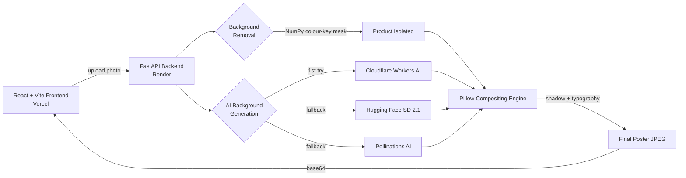

<div align="center">

# AI Ad Builder

**Turn a raw product photo into a studio-quality ad campaign — automatically, in under 15 seconds.**

[](https://ai-ad-builder-eight.vercel.app/)
[](https://ai-ad-builder-eight.vercel.app/)
[](https://render.com)
[](#license)

[](#)
[](#)
[](#)
[](#)
[](#)
[](#)

**[Live Demo](https://ai-ad-builder-eight.vercel.app/) · [Features](#features) · [Architecture](#architecture) · [Getting Started](#getting-started) · [Team](#team)**

</div>

---

## Demo

<div align="center">

<!--
  Add a screen recording here — it's the single biggest upgrade you can make to this README.
  1. Record a 10-15s clip of uploading a product photo and getting the poster back
     (use ScreenToGif, Kap, or Peek — all free).
  2. Save it as demo.gif in a /docs or /assets folder in your repo.
  3. Replace the line below with:  
-->

*[Add a demo.gif here showing an upload → generated poster in a few seconds]*

</div>

## Features

- **Zero-click background removal** — isolates your product from its original background automatically
- **AI-generated studio backgrounds** — a resilient 3-provider fallback chain (Cloudflare Workers AI → Hugging Face → Pollinations AI) so generation keeps working even if one provider is down
- **Automatic compositing** — realistic contact shadows and lighting via Pillow/NumPy
- **Custom ad copy overlay** — headline, tagline, and CTA rendered directly onto the poster
- **Multi-format export** — Instagram Post, Instagram Story, Square, and Landscape
- **Async job pipeline** — upload returns instantly with a job ID; the frontend polls for status while the poster renders in the background

## Architecture



| Layer | Technology | Notes |
|---|---|---|
| Frontend | React, Vite | Resizes/compresses images client-side before upload |
| Backend | FastAPI (Python) | Async background tasks, job-status polling |
| Image processing | Pillow, NumPy | Vectorised background removal, shadow rendering, typography |
| AI generation | Cloudflare Workers AI, Hugging Face, Pollinations AI | 3-tier automatic failover |
| Hosting | Vercel (frontend), Render (backend) | |

## Getting Started

### Prerequisites
- Node.js 18+
- Python 3.10+

### Clone the repo
```bash
git clone https://github.com/<your-username>/ai-ad-builder.git
cd ai-ad-builder
```

<details>
<summary><strong>Frontend setup</strong></summary>

```bash
cd frontend
npm install
npm run dev
```
Runs at `http://localhost:5173` by default.

</details>

<details>
<summary><strong>Backend setup</strong></summary>

```bash
pip install -r requirements.txt --break-system-packages
python main.py
```
Runs at `http://localhost:10000` by default. Create a `.env` file with your API keys:

```env
CLOUDFLARE_ACCOUNT_ID=your_account_id
CLOUDFLARE_API_TOKEN=your_api_token
HF_TOKEN=your_huggingface_token
```
(All three are optional individually — the app falls back to the next provider, and to Pollinations AI, which needs no key.)

</details>

<details>
<summary><strong>API reference</strong></summary>

| Endpoint | Method | Description |
|---|---|---|
| `/` | GET | Health check |
| `/generate-premium-poster` | POST | Upload a product image + style/format/copy, returns a `job_id` |
| `/job-status/{job_id}` | GET | Poll for job status and the final poster once finished |

</details>

## Roadmap

<details>
<summary>See what's planned next</summary>

- [ ] User accounts to save and revisit past campaigns
- [ ] ML-based background removal (e.g. segmentation model) for complex backgrounds
- [ ] Custom brand kits — fonts and hex codes for CTA buttons
- [ ] Multi-format automation via n8n (Stories, Carousels, Display banners in one click)
- [ ] Vision-model auto-tagging of the uploaded product

</details>

## Team

| | | |
|---|---|---|
| Umair Ahmed Siddiqui | Abdul Rafay | Hooria Maqsood |
| Samiya Sharif | Saniaa Tahir | Zainab Younus |


---

<div align="center">
Built for a hackathon submission · <a href="https://ai-ad-builder-eight.vercel.app/">Try it live</a>
</div>
